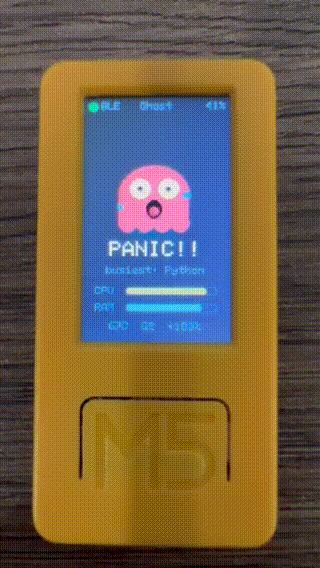
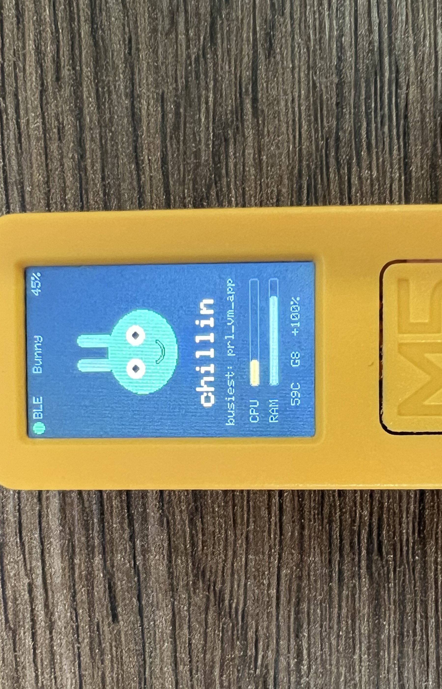
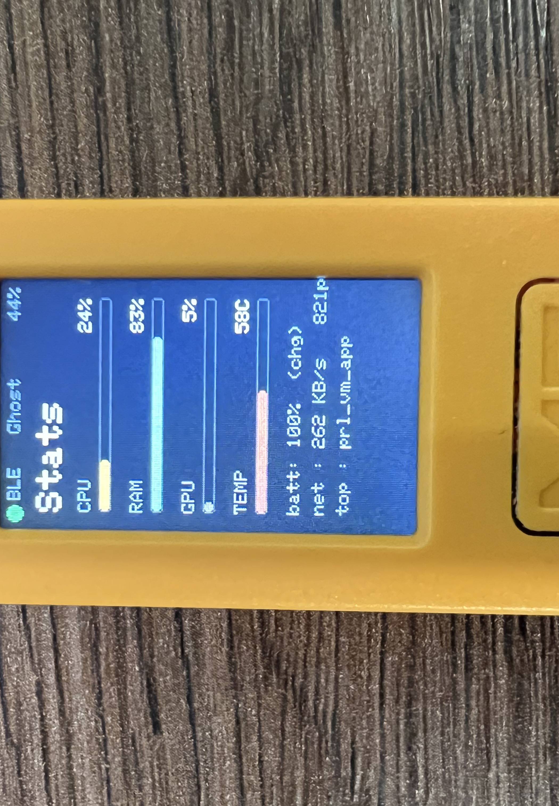
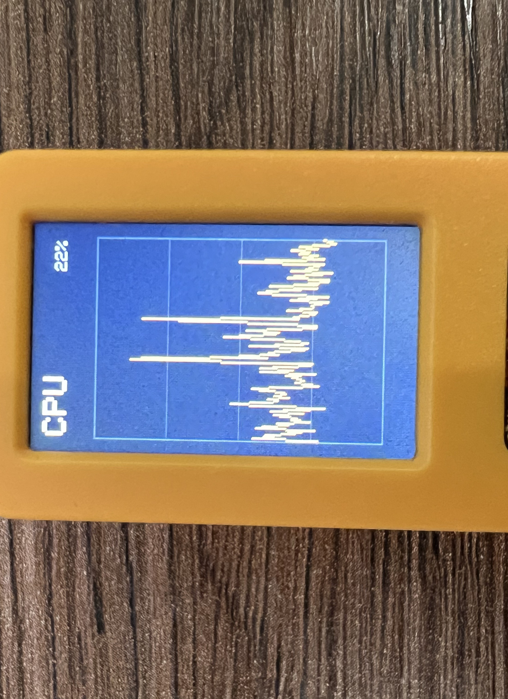
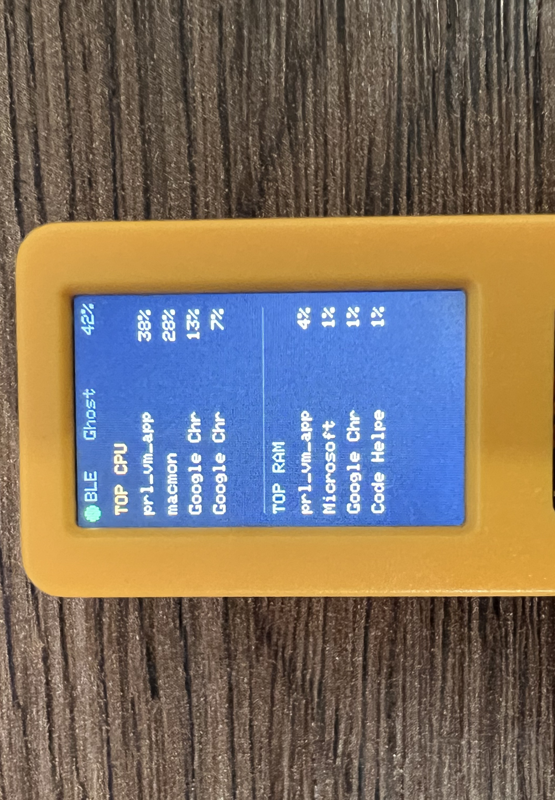
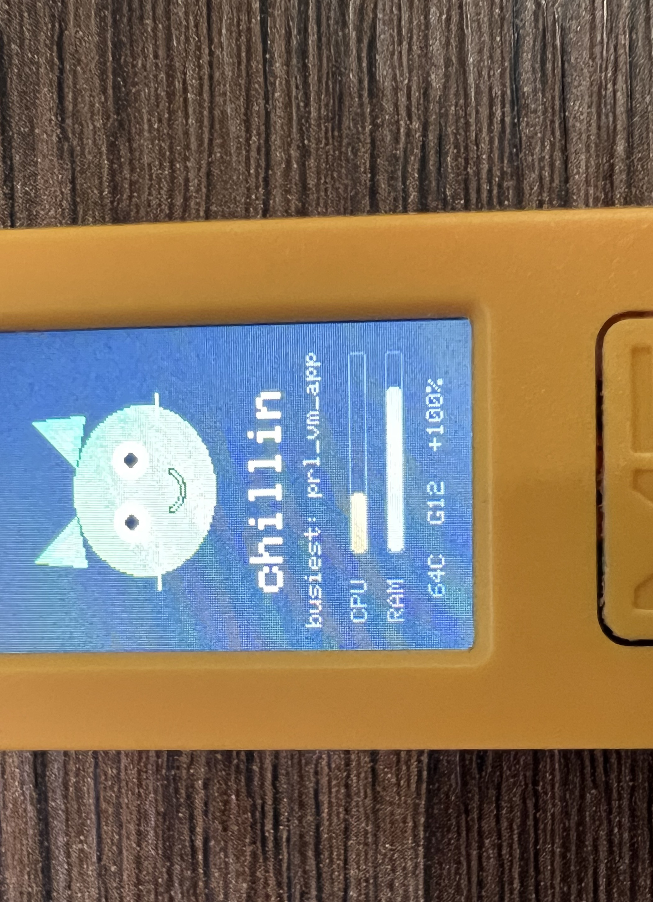
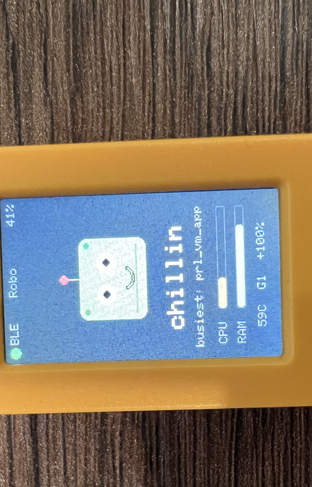

# PC-Pet — a Tamagotchi for the M5StickC Plus2

A virtual creature on the M5StickC Plus2 whose mood mirrors the state of your
computer. The PC streams metrics (CPU, RAM, GPU, temperature, network, disk,
battery, top processes) to the device over BLE; the device renders an animated
pet plus several info screens.




## Layout

```
pc-pet/
├── README.md                     # this file
├── CLAUDE.md                     # working notes / conventions for Claude Code
├── firmware/
│   └── pc_tamagotchi/            # one Arduino sketch, split into tabs
│       ├── pc_tamagotchi.ino     # main: globals, BLE, parsePacket, setup, loop
│       ├── pet_types.h           # shared enums/structs (MelNote, Mood, View, ...)
│       ├── pet_helpers.ino       # logic helpers (mood, colours, panic, trend, ENV)
│       └── pet_render.ino        # character art + pet renderer + view screens
├── agent/
│   ├── pc_pet_agent.py           # host agent (Python, psutil + bleak)
│   ├── scan.py                   # BLE scan diagnostic
│   └── requirements.txt
├── tools/
│   ├── cpu_stress.py             # CPU load generator for testing moods
│   └── env_viewer/               # standalone ENV CSV viewer TUI (PCP-011)
├── docs/
│   ├── protocol.md               # BLE packet protocol reference
│   ├── firmware-internals.md     # detailed firmware walkthrough
│   └── development-workflow.md   # Claude Code skills usage guide
├── specification/
│   ├── phase1-core-mechanics.md  # Phase 1 issue specs
│   └── phase1-github-report.md   # upload report (PCP-xxx -> GitHub #)
└── .claude/
    └── skills/                   # Claude Code slash commands
        ├── upload-issues/
        ├── execute-issues/
        └── release-version/
```

## Architecture

```
+---------------------------+         BLE (NUS)         +-------------------------+
|         PC (Central)      | ----------------------->  |   M5StickC Plus2        |
|                           |    Write Request ~1.5s    |     (Peripheral)        |
|  +---------------------+  |                           |  +-------------------+  |
|  |  pc_pet_agent.py    |  |   cpu,ram,temp,net,...    |  |  pc_tamagotchi    |  |
|  |                     |  |   ;cpuList;ramList        |  |     .ino          |  |
|  |  psutil  --> metrics |  |                           |  |                   |  |
|  |  macmon  --> temp/gpu|  |  RX char (6E400002...)    |  |  parsePacket()    |  |
|  |  bleak   --> BLE     |  |                           |  |  currentMood()    |  |
|  +---------------------+  |                           |  |  drawPet()        |  |
+---------------------------+                           |  +-------------------+  |
                                                        |                         |
                                                        |  LCD  Speaker  IMU      |
                                                        +-------------------------+
```

BLE over the Nordic UART Service. The **PC is the central** -- it connects,
collects system metrics, and writes an ASCII packet into the device's RX
characteristic every ~1.5 seconds. The **device is the peripheral** (GATT
server) -- it parses the packet, computes a mood, and renders the pet.
See `docs/protocol.md` for the wire format.

- Device firmware: Arduino C++ with M5Unified (display/IMU/power/buzzer) and the
  bundled ESP32 BLE library.
- Host agent: Python with `psutil` (metrics) and `bleak` (BLE). On Apple Silicon,
  CPU temperature and GPU load come from `macmon` (sudoless); battery from psutil.

## Hardware

- M5StickC Plus2 (ESP32-PICO-V3-02), USB-serial chip CH9102 (needs the CH9102/CH34x
  VCP driver on macOS; the port shows up as `/dev/cu.wchusbserial*`).
- Optional: ENV III HAT (SHT30 + QMP6988) on the top connector for room
  temperature / humidity / pressure — see ROADMAP.

## Build & flash the firmware

### Prerequisites

- **Arduino IDE 2.x** (download from https://www.arduino.cc/en/software)
- **CH9102 / CH34x USB-serial driver** (macOS): download from
  https://www.wch-ic.com/downloads/CH34XSER_MAC_ZIP.html -- without it the
  stick will not appear as a serial port. After installing, the port shows up
  as `/dev/cu.wchusbserial*`.

### One-time board setup

1. Open Arduino IDE, go to **File > Preferences**.
2. In **Additional boards manager URLs**, add:
   ```
   https://static-cdn.m5stack.com/resource/arduino/package_m5stack_index.json
   ```
3. Go to **Tools > Board > Boards Manager**, search for **M5Stack**, and
   install the **M5Stack** board package (includes ESP32 cores).
4. Select board: **Tools > Board > M5Stack > M5StickCPlus2**.

### Install libraries

Go to **Tools > Manage Libraries** and install:
- **M5Unified** (by M5Stack) -- hardware abstraction for display, IMU, power,
  speaker
- **M5GFX** (by M5Stack) -- graphics and canvas rendering (installed
  automatically as a dependency of M5Unified)
- **M5Unit-ENV** (by M5Stack) -- ENV III HAT sensors (SHT30 + QMP6988). Only
  needed if you fit the ENV III HAT; the firmware presence-checks at boot and
  runs normally without it.

The BLE libraries (`BLEDevice`, `BLEServer`, `BLE2902`) are bundled with the
ESP32 Arduino core and do not need separate installation.

### Flash

1. Connect the M5StickC Plus2 via USB-C.
2. **Tools > Port** -- select the `wchusbserial` port (e.g.
   `/dev/cu.wchusbserial14210`). If the port is missing, install the CH9102
   driver above.
3. **Close the Serial Monitor** if it is open -- it holds the port and the
   upload will fail with `serial.serialutil.SerialException`.
4. Open `firmware/pc_tamagotchi/pc_tamagotchi.ino` and click **Upload**
   (arrow button).
5. Wait for compilation and upload. On success the last line reads:
   ```
   Hard resetting via RTS pin...
   ```
   The stick reboots and the pet appears on screen.
6. Open **Tools > Serial Monitor** at **115200 baud** to see debug output:
   boot messages, BLE connect events, and `RX(...)` packet lines when the
   agent is running.

### Troubleshooting

- **Port not visible:** install the CH9102 driver, unplug and replug the USB
  cable, or try a different USB-C cable (some are charge-only).
- **Upload fails with "A fatal error occurred: Failed to connect":** hold the
  power button for 6 seconds to force-reset, then try again.
- **Compilation error "BUSY/HOT redefined":** mood enum values must use the
  `M_` prefix (`M_BUSY`, `M_HOT`) -- the ESP32 ROM headers define unprefixed
  names.
- **BLE writes stop arriving after reflash:** toggle Bluetooth off/on on
  macOS (or reset the Bluetooth module), then restart the agent. macOS caches
  the GATT table.

## Run the agent

```bash
cd agent
python3 -m pip install -r requirements.txt
# Apple Silicon: for CPU temp + GPU load
brew install vladkens/tap/macmon

python3 pc_pet_agent.py
# options: --name PCpet --interval 1.5 --address <BLE-addr>
# ENV telemetry (ENV III HAT): device notifies room readings, logged to a CSV
#   --env-log env_log.csv         CSV path (empty string disables logging)
#   --env-log-max-bytes 5000000   rotate the log at this size (size-based)
#   --env-log-keep 5              rotated files kept; disk <= (keep+1)*max-bytes
```

`scan.py` lists all advertising BLE devices — useful to confirm the stick is
visible and to grab its address.

## Testing the moods

`tools/cpu_stress.py` generates synthetic CPU load so you can watch the pet move
through its moods without real work. Standard library only, no dependencies.

```bash
cd tools
python3 cpu_stress.py                 # ~100% on all cores until Ctrl+C
python3 cpu_stress.py --percent 70    # hold ~70% overall
python3 cpu_stress.py --ramp          # step 10 -> 40 -> 70 -> 95 and back
python3 cpu_stress.py --percent 90 --duration 30
```

Mood thresholds (from the firmware): CPU < 15 sleeps, >= 50 is busy, >= 85 panics.
`--ramp` walks those boundaries automatically, holding each level (`--hold`, 15 s
default) so you can see each state on the device.

## Controls

- **BtnA** (front, M5 logo): cycle screens — Pet -> Stats -> Graph -> Procs -> Env.
  The Env screen is included in the cycle only when the ENV III HAT is attached.
- **BtnB** (side): single click cycles the character; double click toggles mute.
- **Power button** (lower left): short click toggles the screen on/off; hold ~1 s
  powers the device off. A sustained strong shake also wakes the screen.

## Screens

| Pet | Stats | Graph | Procs |
|:---:|:---:|:---:|:---:|
|  |  |  |  |

- **Pet** — the creature + mood word + CPU/RAM bars + footer (temp / GPU / PC battery).
- **Stats** — CPU / RAM / GPU / TEMP bars + battery / disk I/O / net / top process.
- **Graph** — scrolling CPU history.
- **Procs** — top processes by CPU and, separately, by RAM.
- **Env** — room temperature, humidity, and barometric pressure (with a rising /
  falling / steady trend). Appears only when the ENV III HAT is attached.

## Characters

| Bunny | Cat | Robo |
|:---:|:---:|:---:|
|  |  |  |

Blobby, Cat, Robo, Ghost, Bunny — cycled with a single click on BtnB. All share
the same mood-driven expressions; only the body silhouette differs.

## Behavior

### Moods

The pet's mood is computed on-device from the latest metrics. When multiple
conditions are true, the first match wins (priority order top to bottom):

| Mood | Condition | Look |
|---|---|---|
| HOT | temp >= 75 C | orange body, wide eyes, open mouth, sweat |
| PANIC | cpu >= 85% OR ram >= 92% OR gpu >= 95% | red body, shaking, wide eyes, sweat |
| LOW PWR | battery 0-19% and not charging | muted gray, droopy half-closed eyes |
| STUFFED | ram >= 85% | brown-ish body, flat mouth |
| BUSY | cpu >= 50% OR gpu >= 60% | yellow body, bouncing, little legs, darting eyes |
| SLEEP | cpu < 15% AND gpu < 15% | blue body, closed eyes, floating Zzz |
| HAPPY | everything else (default) | green body, smile, gentle breathing |

When the agent is not connected, the pet shows SLEEP with a "waiting" message.

When the ENV III HAT is attached, room readings can add one of two optional mood
modifiers, but only while the PC-driven mood is the calm HAPPY state:

- **STUFFY** — room temperature >= 27 C and humidity >= 60%. Overrides the mood
  to STUFFED and shows a "stuffy" badge.
- **WEATHER** — barometric pressure is falling (pressure trend < 0). Shows a
  "weather" badge without changing the mood.

### Panic tiers

If the PC stays in PANIC continuously, the pet's distress escalates through
three tiers. It reverts instantly to its normal mood as soon as panic clears.

| Tier | Duration | Visual | Sound | Mood word |
|---|---|---|---|---|
| 1 | 0 -- 9 s | standard panic look | MEL_ALERT on entry | PANIC!! |
| 2 | 10 -- 29 s | darker red body, 4 px jitter, extra sweat | MEL_PANIC2 | PANIC!!! |
| 3 | 30 s+ | desaturated body, half-closed eyes, wavy mouth, pulsing red overlay | MEL_PANIC3 | CRITICAL |

### Connection and data flow

The agent samples system metrics every **1.5 seconds** (configurable with
`--interval`) and writes an ASCII packet to the device over BLE. The device
treats the link as stale if no packet arrives for **6 seconds** and falls back
to SLEEP / "waiting."

On disconnect the device re-advertises automatically. The agent reconnects on
the next scan cycle.

### ENV telemetry

When the ENV III HAT is attached and the link is up, the device notifies the PC
with the latest room readings every **5 seconds** over the TX characteristic
(`ENV;temp=..;hum=..;press=..`). The agent appends each reading to a rotating
CSV (`--env-log`, default `env_log.csv`). This channel is autonomous from the
PC-to-device metric stream.

### Screen power management

The screen dims and eventually turns off to save power when idle:

| State | Trigger | Brightness |
|---|---|---|
| Full | activity (button, shake, alert mood) | 110 |
| Dim | 10 s idle | 55 |
| Off | 30 s idle | 0 (rendering skipped) |

The screen wakes on:
- Any button press
- Sustained strong shake (acceleration > 1.2 g for 750 ms)
- Alert mood (HOT or PANIC keep the screen fully awake automatically)
- Low battery alert

Frame rate is ~18 fps (55 ms loop) when the screen is on, ~6.7 fps (150 ms)
when off.

### Low battery alert

When the M5Stick's own battery drops below **10%**, the device plays a
descending two-tone beep (MEL_LOWBATT) and wakes the screen. The alert
repeats every **2 minutes** as long as the battery stays low.

### Mute

Double-click BtnB to toggle mute. When muted, all sounds are suppressed --
button clicks, mood alerts, panic tier transitions, and low battery beeps.
The top bar shows "mute" in orange. Unmuting plays a short confirmation tone.

### Sounds

Each event has a distinct melody played through the `playMelody()` system:

| Event | Melody | Notes |
|---|---|---|
| BtnA click | MEL_CLICK | 1500 Hz, 30 ms |
| BtnB character switch | MEL_CHARSWITCH | 1700 Hz, 30 ms |
| Unmute | MEL_MUTE_OFF | 1800 Hz, 40 ms |
| Mood escalation (enter PANIC/HOT) | MEL_ALERT | 2300 Hz x2 |
| Panic tier 2 transition | MEL_PANIC2 | 4-note rising pattern |
| Panic tier 3 transition | MEL_PANIC3 | 5-note urgent pattern |
| Low battery | MEL_LOWBATT | 800 Hz descending to 600 Hz |

## Development workflow

Claude Code skills automate the spec-to-release pipeline. See
[docs/development-workflow.md](docs/development-workflow.md) for details on
`/upload-issues`, `/execute-issues`, and `/release-version`.

## Known notes

- macOS may cache the GATT table after repeated reflashes; if writes stop
  arriving, toggle Bluetooth off/on (or reset the Bluetooth module), then restart
  the agent.
- Battery percentage on the stick is voltage-derived and approximate.
